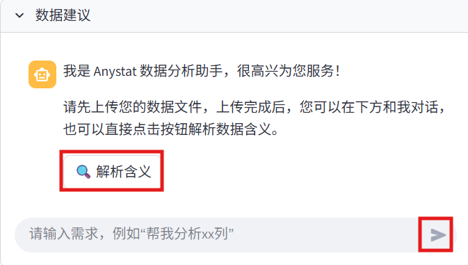
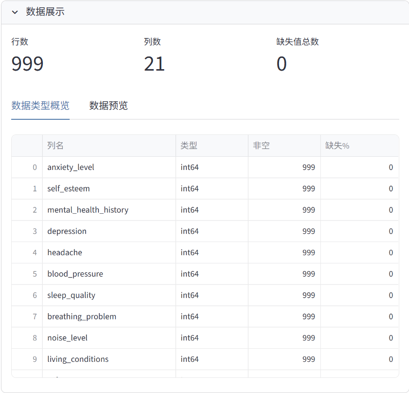
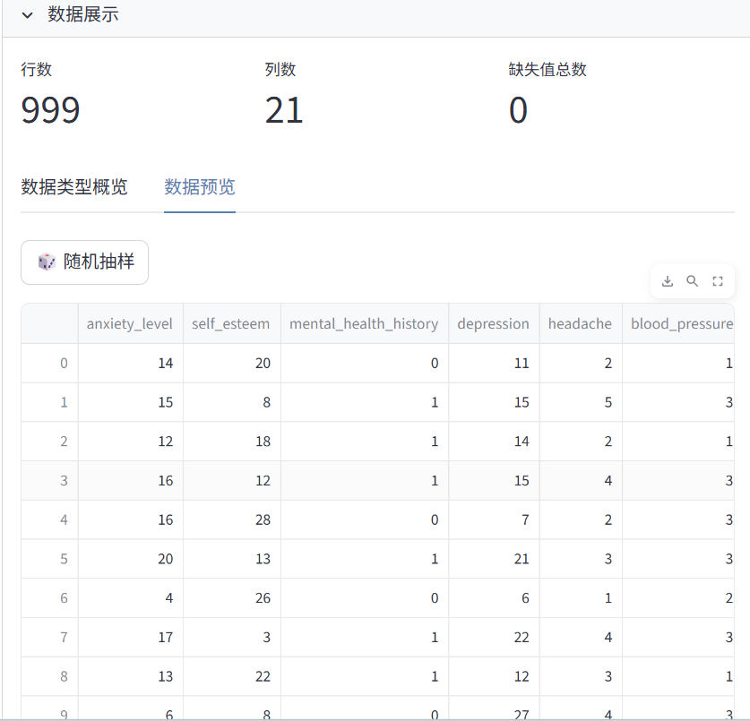
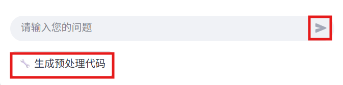
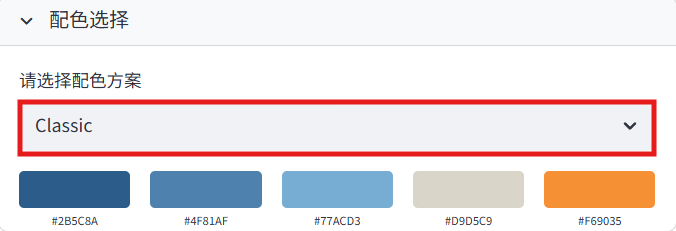
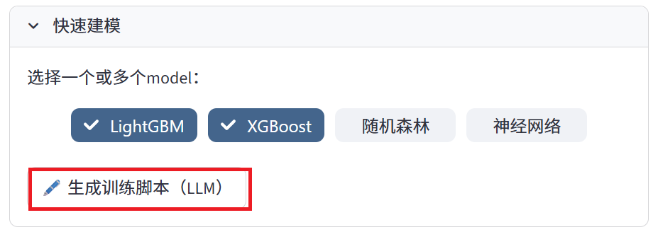
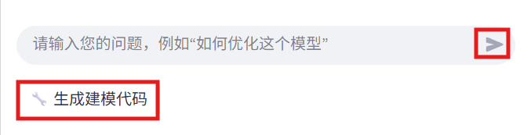
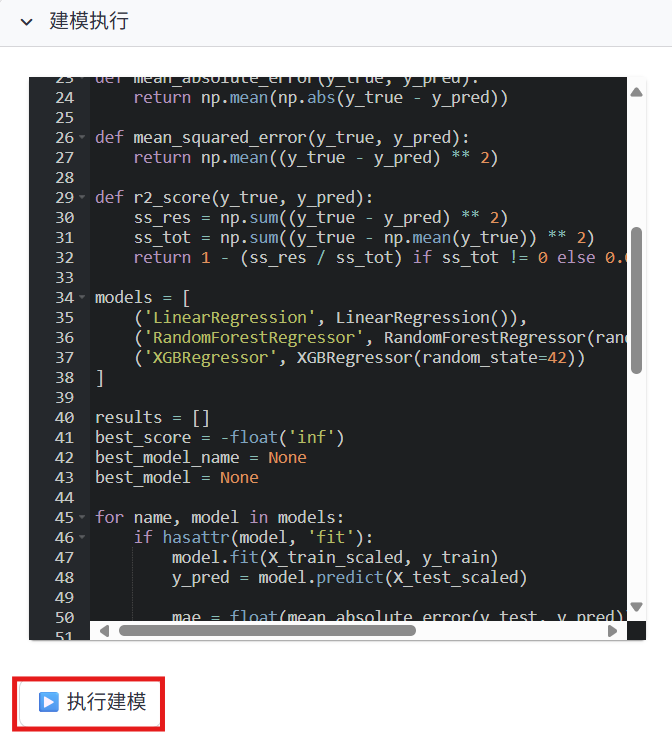
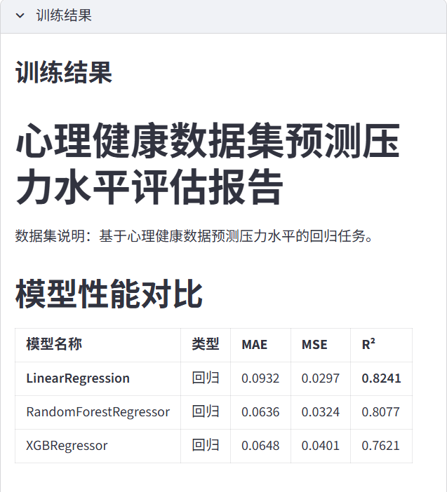
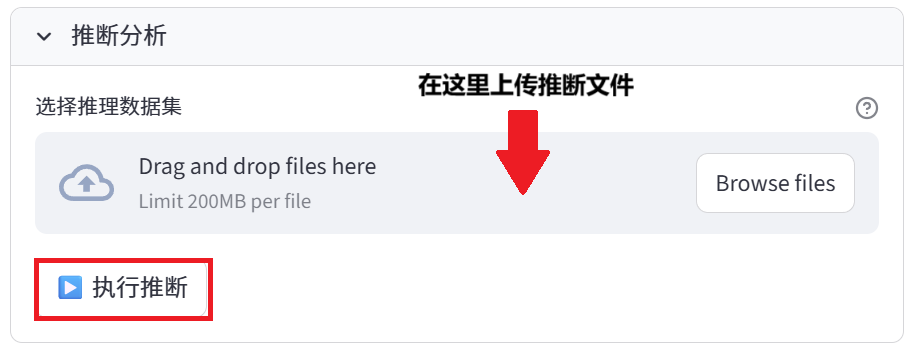

# Anystat 文档

> 零基础入门指南：Anystat 可视化数据分析 Agent 使用手册
---

## Anystat简介

> "Anystat" 是一个基于 Streamlit 的可视化数据分析 agent，无需编程基础即可轻松完成数据导入、预处理、分析与报告生成全流程，大幅简化与大语言模型的交互流程。  
> 无论你是数据分析的小白还是能玩转数据的大师，Anystat 都可以帮助你快速完成数据分析并生成报告。

* **功能特点**
  * 支持数据文件拖拽上传
  * 自动数据概览和可视化
  * 智能数据预处理
  * 交互式统计分析
  * 一键生成分析报告
* **效果展示**
 /  ...

## 安装部署

* **环境准备**
  * 操作系统：Windows/Linux/MacOS
  * Python版本：Python 3.9+（***必须安装，推荐安装 Python 3.11+***）
  * Anaconda（***必须安装***）
  * Github Desktop（***非必须，但推荐安装***）
  
* **安装步骤**

  **以下安装步骤均在终端中进行**。若未下载 Github Desktop，则不使用第一步，把从 Github 上下载的 `.zip` 文件在本地文件夹解压缩。

  1. 克隆项目到本地

  ```bash
  gh repo clone ElvisWang1111/AAAAAnystat
  ```

  2. 将工作目录转到 Anystat 本体文件所在文件夹

  ```bash
  cd (your working directory)
  ```

  其中将括号和之内的内容替换为 Anystat 的文件夹地址即可。

  3. 创建虚拟环境

  ```bash
  conda create --name Anystat
  conda activate Anystat
  ```

  4. 安装依赖项

  ```bash
  pip install -r requirements.txt
  pip install playwright
  playwright install
  ```

* **安装常见问题及解决方案**

  Q: 如何准备 Python 环境？

  A: **Windows 端**
  
  从 Python 的[官方站点](https://www.python.org/)下载版本在3.9及以上的安装包，安装时务必勾选 **Add Python 3.x to PATH**。安装后打开终端输入

  ```bash
  python --version
  ```

  只要输出

  ```bash
  Python (*version*)
  ```

  其中 `(*version*)` 是实际输出的版本，应不低于 3.9，则说明安装成功。

  安装 Anaconda 也请在[官方站点](https://www.anaconda.com/download)进行下载。

  **Mac 端**

  Mac 一般有已安装的版本较低的 Python，安装的方法和 Windows 是类似的，详情请跳转至[官方站点](https://www.python.org/downloads/macos/)，下载 `.pkg` 文件并安装对应版本。

  **Linux 端**

  Linux （或 Ubuntu） 是有内置的 Python 的，只要在 Linux 内升级或检查版本即可。若要更新 Python， 请在终端中输入

  ```bash
  sudo apt update
  ```

  如果想要安装指定版本，则输入

  ```bash
  sudo apt install python3.x
  ```

  将 `3.x` 替换为你想要安装的版本即可。想要验证版本，以 Python 3.12.7 为例，输入

  ```bash
  python3.12.7 --version
  ```

  便可获得版本序列号。

## 教程与展示

* **首次启动与 API 配置**

  1. 若虚拟环境没有启用（直接看终端的交互行最左侧是否有被圆括号包围的字母），则使用

  ```bash
  conda activate Anystat
  ```

  启用，这里的虚拟环境 `Anystat` 是在“安装部署”章节的“安装步骤”中创建好的。

  2. 启动应用：

  ```bash
  streamlit run app.py
  ```  

  以启用虚拟环境

  2. 在浏览器中打开显示的地址（通常是 `http://localhost:8501` ），这一步通常不需要手动操作，但若没有响应则将终端中的地址粘贴至浏览器中 Enter 即可。

  3. **本程序运行需要提供 API key 来请求大模型调用，费用由用户承担。** 目前支持的平台是 ChatGPT，Deepseek，通义千问和智谱AI。注意在使用前在左侧边栏选择相应的大模型并填入API key后保存(API获取方法详见[**API key获取途径**](#相关资源))

* **结束运行**

  在结束运行时直接关闭浏览器 **不会真正关闭端口，需要在运行的终端处按下 `Ctrl+C` 来关闭端口来结束进程** 。 此外，请输入

  ```bash
  conda deactivate
  ```

  以关闭虚拟环境。

* **数据导入模块**

1. 选择数据上传方式：

    * 选择本地上传：点击上传按钮或直接拖动数据文件上传（适用于小于 200MB 的文件导入）
    * 选择路径导入：输入具体的文件地址路径（适用于大文件导入）

   

2. 看到数据展示和数据建议模块即为上传成功，可以在数据建议模块点击按钮或交互以生成对数据集的描述。

   

   在数据展示模块可以看到数据类型概览，

   

   可以切换到数据预览界面查看数据行，还可以进行随机抽样。**随机抽样的结果仅供查看数据行的完整性，不会用于后续操作，也不能保存。**

   

> 建议上传的数据列数少一些，不超过15列，否则会大大延长分析的时间。

* **数据预处理模块**

1. 预处理展示模块展示列名、数据类型、非空值数量及缺失值比例，以便确定预处理建议。

   

2. 与 agent 进行交互获取数据预处理建议，建议生成后，在对话栏下方会弹出“根据 LLM 意见进行预处理”按钮，点击即可生成可执行的 python 脚本代码。

  > 若有多个需求，可以分多次输入，无需一次性询问 agent。也可以点击按钮和对话兼有，agent 也会处理您的请求。

   
   

3. 在数据执行模块下可对生成代码进行修改和执行。

  > 运行过程中可能会多次报错，但 Anystat 助手会帮您修复 bug，无需人工检查。

   

4. 在预处理结果模块下可查看处理前后数据和下载处理好的数据

   

* **数据可视化模块**

1. 在配色选择模块下选择您喜欢的配色方案：

   

2. 在可视化建议模块下与 agent 进行交互获取可视化建议，建议生成后，在对话栏下方会弹出“根据LLM意见生成代码”按钮，点击即可生成可执行的 Python 脚本代码。

   > 运行过程中可能会多次报错，但 Anystat 助手会帮您修复 bug，无需人工检查。

   

   

3. 在可视化执行模块下可对代码进行修改和执行以及选择是否附加分析：

   

4. 在可视化执行模块点击“执行脚本”并在可视化结果模块下查看相应结果。生成的图象可以翻页查看（见红框内）。

   

* **数据建模模块**

1. 可在快速建模模块下选择模型后，点击“生成训练脚本（LLM）”按钮，快速生成训练代码，生成的建模代码范围即页面上提供的4种。

   

2. 若想要和数据分析一样让 agent 推荐其他模型，可与 agent 进行交互获取建模建议，建议生成后，在对话栏下方会弹出“根据 LLM 意见生成代码”按钮，点击即生成可执行的 Python 脚本代码。

   
   

3. 在建模执行模块下可对代码进行修改和执行，点击“执行脚本”后可以查看训练结果和下载最佳模型。

   > 运行过程中可能会多次报错，但 Anystat 助手会帮您修复 bug，无需人工检查。**可以尝试多次向 LLM 请求代码生成以降低错误率。**

   
   

4. 完成建模任务后，推断分析模块通道开启，可上传待推断的数据，根据最佳模型进行推断。

   

* **报告生成模块**

1. 在报告设置模块设置报告详细程度、报告日期、报告作者、报告格式、生成要求，**先不要点击“生成报告”按钮**

   

2. 在报告大纲模块下可编辑目录结构并生成目录

   

3. 完成目录编辑后，在报告设置中点击“生成报告”，在报告展示模块下可下载报告，生成并自动下载 PDF

   

## 使用示例

* **小规模数据量示例（<1000条）**
我们使用Kaggle经典数据集"Titanic dataset"（train.csv中891条数据）作为测试数据集。
各部分耗时情况如下：
* 数据预处理：约3min
* 数据可视化：约6min
* 数据建模：约10min
* 报告生成：约8min

* **中等规模数据量示例（1000条-10000条）**
我们使用Kaggle经典数据集"House Prices: Advanced Regression Techniques"（train.csv中1460条数据）作为测试数据集。
各部分耗时情况如下：
* 数据预处理：约5min
* 数据可视化：约8min
* 数据建模：约13min
* 报告生成：约10min

* **大规模数据量示例（>10000条）**
我们使用Kaggle经典数据集"共享单车需求数据集（Bike Sharing Dataset）"（包含10886条记录）作为测试数据集。
各部分耗时情况如下：
* 数据预处理：约7min
* 数据可视化：约12min
* 数据建模：约15min
* 报告生成：约14min

## 相关资源

* **常见错误处理**
* **部分教程示例**
* **API key获取途径**  
  [Deepseek API key](https://platform.deepseek.com/usage "单击以访问 Deepseek 开放平台")  
  [ChatGPT API key](https://platform.openai.com/docs/overview "单击以访问 OpenAI Platform")（**需要信用卡支付**）  
  [通义千问 API key](https://bailian.console.aliyun.com/?spm=5176.29597918.J_SEsSjsNv72yRuRFS2VknO.2.54d87b08CphuY5&tab=model#/efm/model_experience_center/text "单击以访问阿里云百炼平台")（**提供一定量免费额度**）  
  [智谱AI](https://docs.bigmodel.cn/cn/guide/develop/http/introduction "单击以访问智谱AI API调用说明页")

* **反馈途径**
* **更改日志（上线后）**

## 贡献与支持
