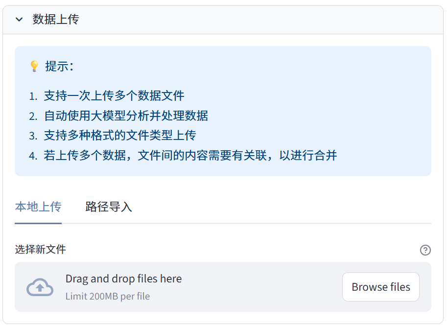
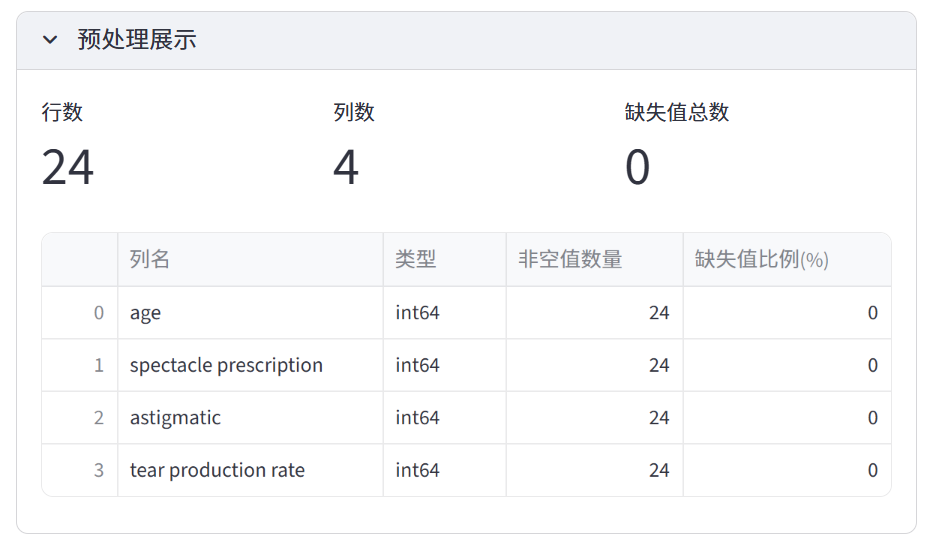

# Anystat 文档

> 零基础入门指南：Anystat 可视化数据分析 Agent 使用手册

## Anystat简介

"Anystat" 是一个基于 Streamlit 的可视化数据分析 agent，无需编程基础即可轻松完成数据导入、预处理、分析与报告生成全流程，大幅简化与大语言模型的交互流程。
无论你是数据分析的小白还是能玩转数据的大师，Anystat 都可以帮助你快速完成数据分析并生成报告。

### 功能特点

- 支持数据文件拖拽上传
- 自动数据概览和可视化
- 智能数据预处理
- 交互式统计分析
- 一键生成分析报告

### 效果展示

 / 

## 快速开始

请参考[安装部署](installation.md)章节了解如何安装和配置Anystat，然后查看[使用教程](tutorial.md)学习如何使用各个功能模块。

## 贡献与支持

欢迎为项目提供反馈和贡献。如有问题或建议，请通过[相关资源](resources.md)中提供的途径与我们联系。