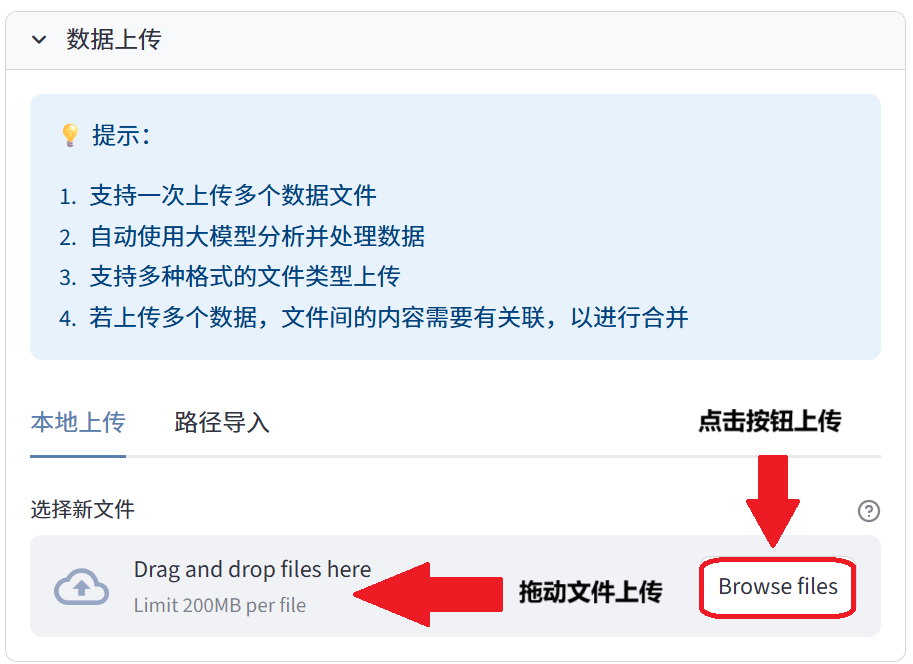
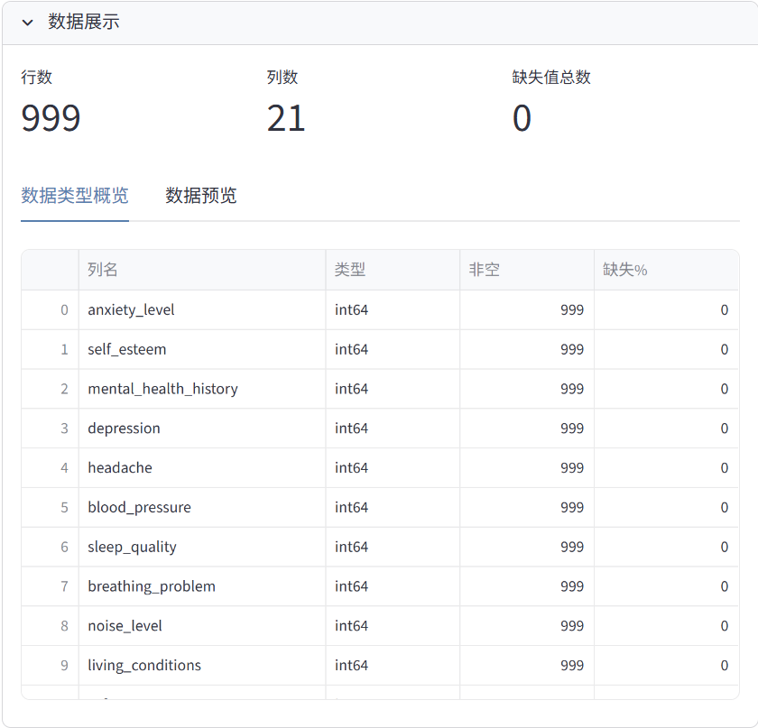
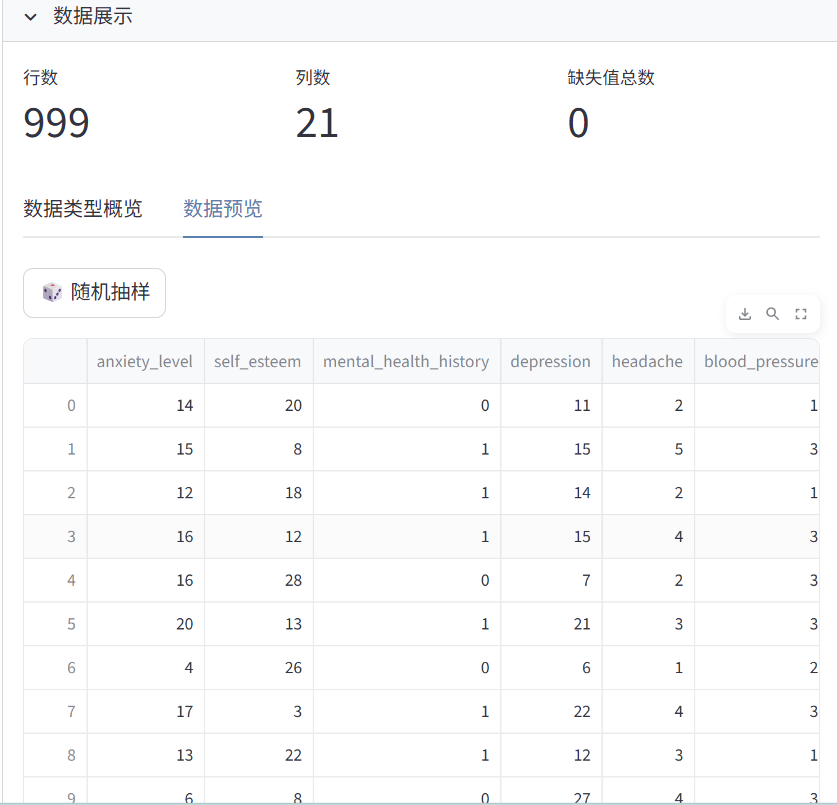

# 数据导入模块

数据导入是使用Anystat进行数据分析的第一步。本章节将介绍如何将数据导入到Anystat中。

## 选择数据上传方式

Anystat提供了两种数据上传方式：

1. **本地上传**：点击上传按钮或直接拖动数据文件上传（适用于小于 200MB 的文件导入）
2. **路径导入**：输入具体的文件地址路径（适用于大文件导入）

## 数据展示

上传成功后，您将看到数据展示和数据建议模块：

### 数据建议

在数据建议模块，您可以点击按钮或交互以生成对数据集的描述。

### 数据类型概览

在数据展示模块，您可以查看数据类型概览：

### 数据预览

您还可以切换到数据预览界面查看数据行，还可以进行随机抽样。**随机抽样的结果仅供查看数据行的完整性，不会用于后续操作，也不能保存。**

## 提示

> 建议上传的数据列数少一些，不超过15列，否则会大大延长分析的时间。

完成数据导入后，您可以继续进行[数据预处理](data-preprocessing.md)。