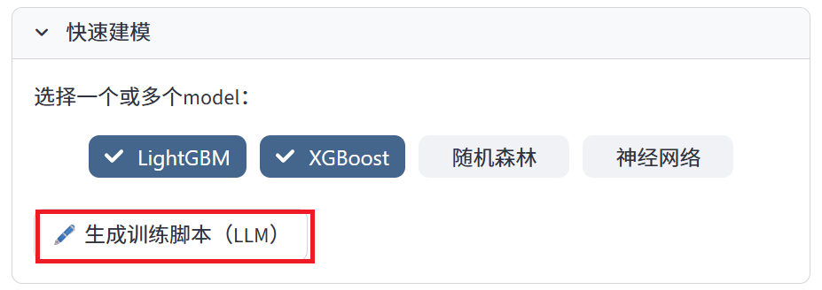
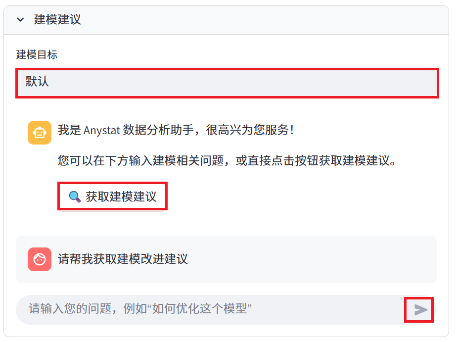
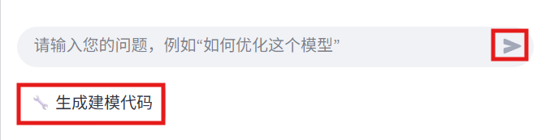
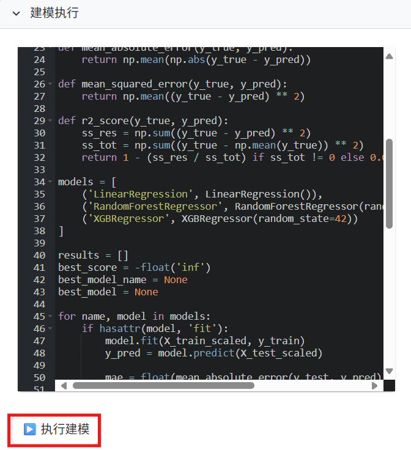
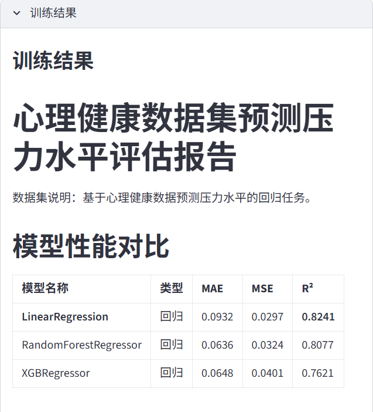
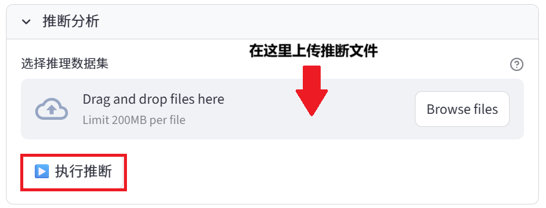

# 数据建模模块

数据建模是数据分析的核心环节。Anystat提供了智能的数据建模功能，帮助您快速构建和评估机器学习模型。

## 快速建模

可在快速建模模块下选择模型后，点击“生成训练脚本（LLM）”按钮，快速生成训练代码，生成的建模代码范围即页面上提供的4种。

## 建模建议

若想要和数据分析一样让 agent 推荐其他模型，可与 agent 进行交互获取建模建议，建议生成后，在对话栏下方会弹出“根据 LLM 意见生成代码”按钮，点击即生成可执行的 Python 脚本代码。

## 建模执行

在建模执行模块下可对代码进行修改和执行，点击“执行脚本”后可以查看训练结果和下载最佳模型。

> 运行过程中可能会多次报错，但 Anystat 助手会帮您修复 bug，无需人工检查。**可以尝试多次向 LLM 请求代码生成以降低错误率。**

## 推断分析

完成建模任务后，推断分析模块通道开启，可上传待推断的数据，根据最佳模型进行推断。

完成数据建模后，您可以继续进行[报告生成](report-generation.md)。