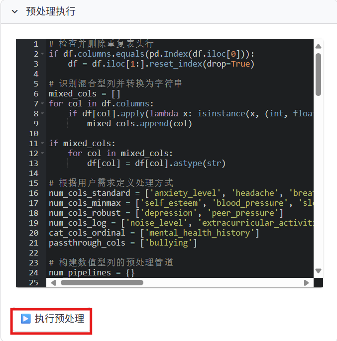

# 数据预处理模块

数据预处理是数据分析过程中的重要环节。Anystat提供了智能的数据预处理功能，帮助您快速清洗和准备数据。

## 预处理展示

预处理展示模块展示列名、数据类型、非空值数量及缺失值比例，以便确定预处理建议。

## 预处理建议

与 agent 进行交互获取数据预处理建议，建议生成后，在对话栏下方会弹出“根据 LLM 意见进行预处理”按钮，点击即可生成可执行的 python 脚本代码。

> 若有多个需求，可以分多次输入，无需一次性询问 agent。也可以点击按钮和对话兼有，agent 也会处理您的请求。

## 预处理执行

在数据执行模块下可对生成代码进行修改和执行。

> 运行过程中可能会多次报错，但 Anystat 助手会帮您修复 bug，无需人工检查。

## 预处理结果

在预处理结果模块下可查看处理前后数据和下载处理好的数据。

完成数据预处理后，您可以继续进行[数据可视化](data-visualization.md)。