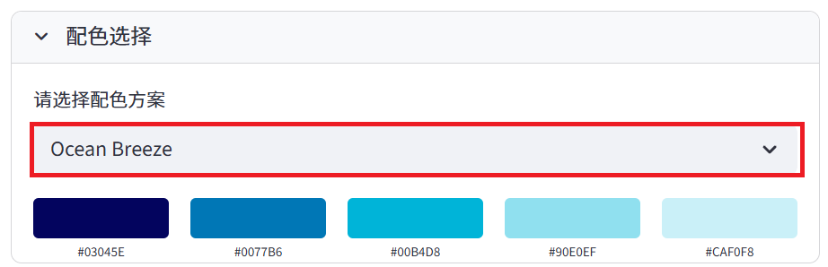
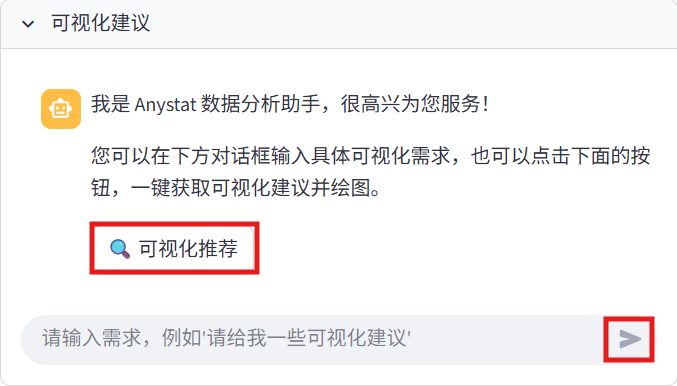
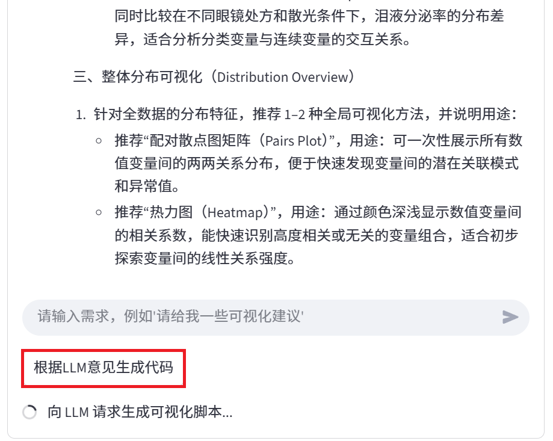
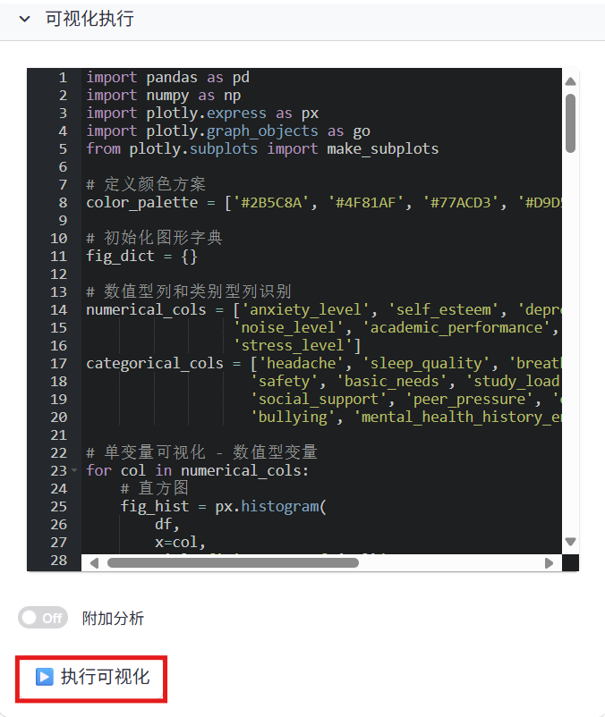
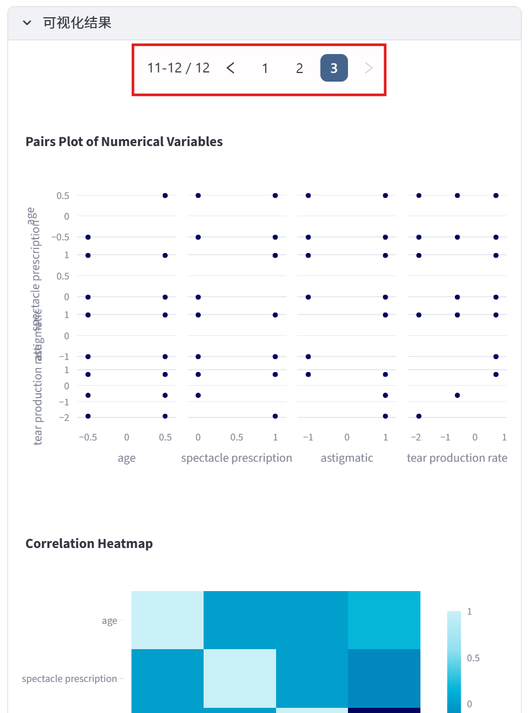

# 数据可视化模块

数据可视化是数据分析的重要组成部分。Anystat提供了丰富的数据可视化功能，帮助您直观地理解数据特征和关系。

## 配色选择

在配色选择模块下选择您喜欢的配色方案：

## 可视化建议

与 agent 进行交互获取可视化建议，建议生成后，在对话栏下方会弹出“根据LLM意见生成代码”按钮，点击即可生成可执行的 Python 脚本代码。

> 运行过程中可能会多次报错，但 Anystat 助手会帮您修复 bug，无需人工检查。

## 可视化执行

在可视化执行模块下可对代码进行修改和执行以及选择是否附加分析：

## 可视化结果

在可视化执行模块点击“执行脚本”并在可视化结果模块下查看相应结果。生成的图象可以翻页查看（见红框内）。

完成数据可视化后，您可以继续进行[数据建模](data-modeling.md)。