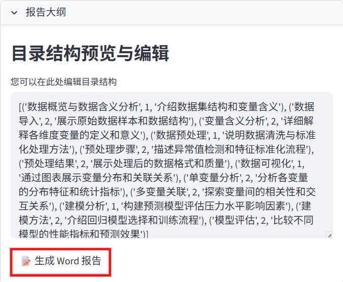

# 报告生成模块

报告生成是数据分析的最后一步，Anystat提供了便捷的报告生成功能，帮助您快速生成专业的数据分析报告。

## 报告设置

在报告设置模块设置报告详细程度、报告日期、报告作者、报告格式、生成要求，**先不要点击“生成报告”按钮**。

## 报告大纲

在报告大纲模块下可编辑目录结构并生成目录：

## 报告展示

完成目录编辑后，在报告设置中点击“生成报告”，在报告展示模块下可下载报告，生成并自动下载 PDF：

完成报告生成后，您的数据分析流程就全部完成了！如有其他需求，可参考[使用示例](../examples.md)和[相关资源](../resources.md)章节。