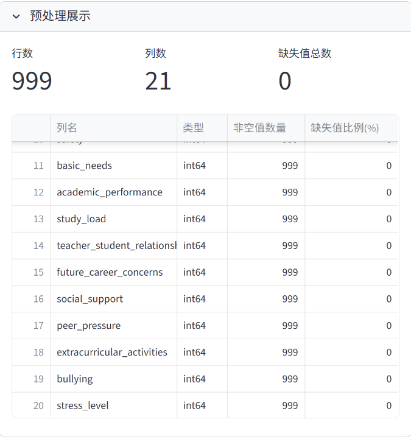
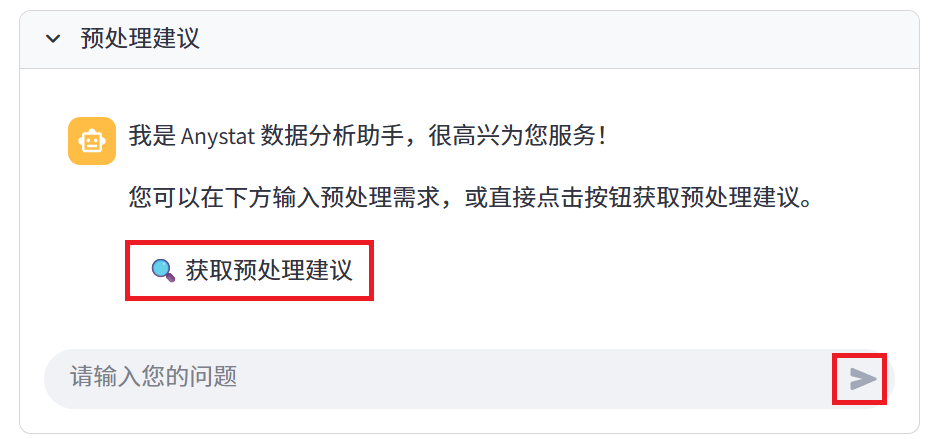
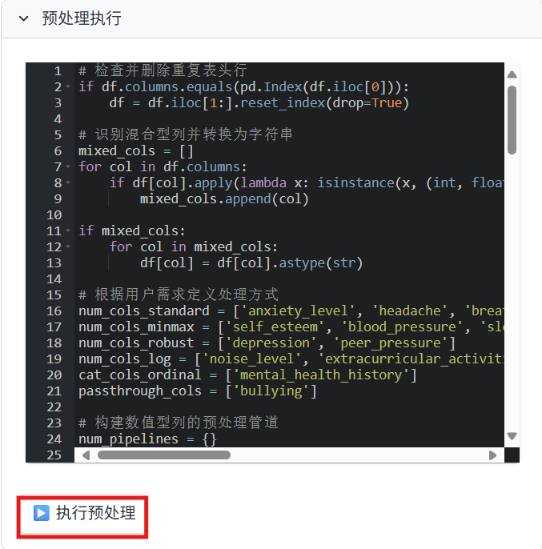
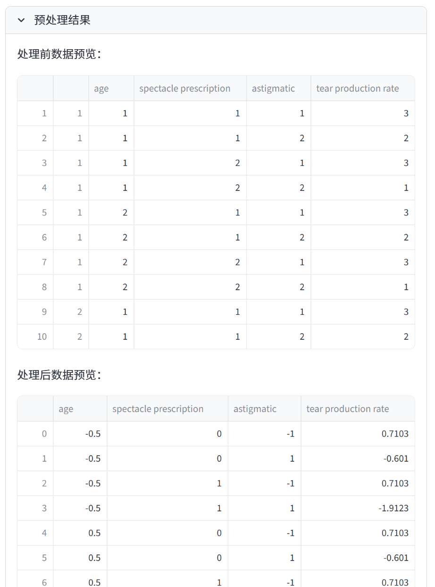

数据预处理模块
============

数据预处理是数据分析过程中的重要环节。Anystat 提供了 Preprocessing Agent 负责数据预处理，帮助您快速清洗和准备数据。

功能特点
---------

.. raw:: html

   <h3>预处理操作建议</h3>

- 除了根据您的数据预处理需求执行操作外， Preprocessing Agent 还可在理解数据集特征的基础上，自动生成预处理建议，协助完成缺失值处理、异常值检测及数据标准化等任务。

.. raw:: html

   <h3>代码执行预处理</h3>

- Preprocessing Agent 可根据系统建议或用户需求，以自动生成代码的方式灵活地执行数据预处理操作。若运行过程中出现错误， Agent 将自动分析并尝试修复。

.. raw:: html

   <h3>预处理结果下载</h3>

- 数据预处理完成后，系统提供结果下载按钮，用户可直接获取预处理后的数据集。

操作教程
----------------

预处理展示
~~~~~~~~~~~~~~~

预处理展示模块显示各列的名称、数据类型、非空值数量及缺失值比例，用于辅助制定预处理方案。

预处理建议
~~~~~~~~~~~~~~~

用户可通过与 Preprocessing Agent 交互获取数据预处理建议。
当建议生成后，系统将在对话栏下方显示 “🔧 生成预处理代码” 按钮，点击该按钮即可自动生成可执行的 Python 预处理脚本。

.. image:: images/数据预处理-代码生成.png
   :alt: 代码生成

预处理执行
~~~~~~~~~~~~~~~

在预处理执行模块中，用户可对生成的预处理代码进行编辑与执行，以灵活调整数据处理流程。

.. note:: 
   大模型生成的代码可能存在错误，运行过程中如发生异常，Preprocessing Agent 将自动分析并尝试修复。

预处理结果
~~~~~~~~~~~~~~~

在预处理结果模块中，用户可以对比查看数据处理前后的变化，并可下载已处理完成的数据集。
数据预处理完成后，Preprocessing Agent 将自动与其他 Agent 进行通信，并在后续步骤中优先使用预处理后的数据集，无需用户额外操作。

完成数据预处理后，您可以根据需求，选择后续操作。 