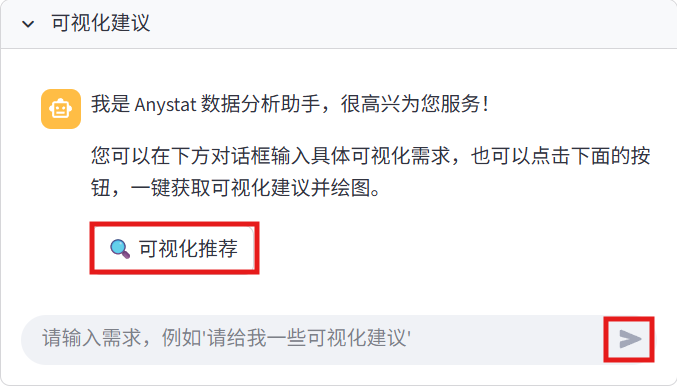
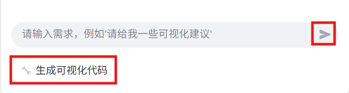
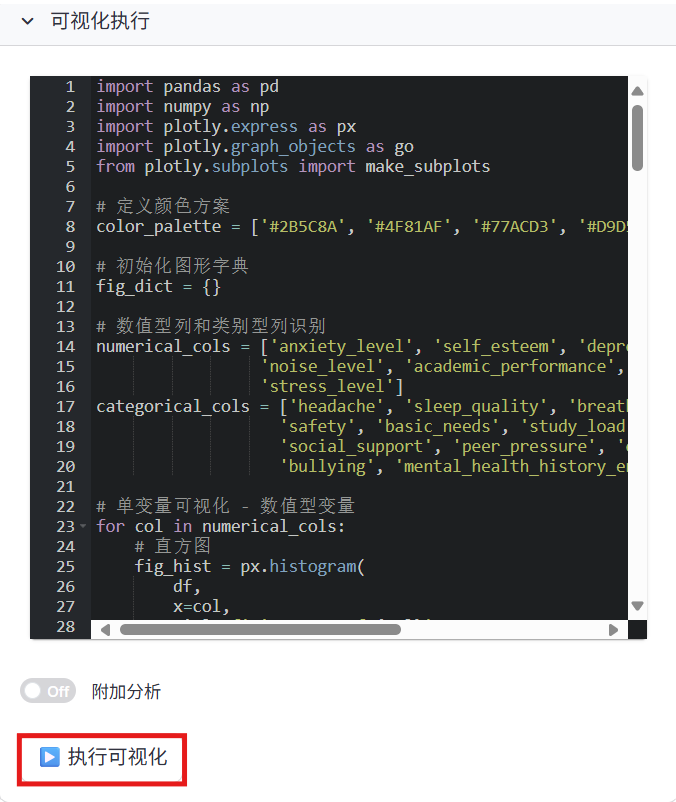
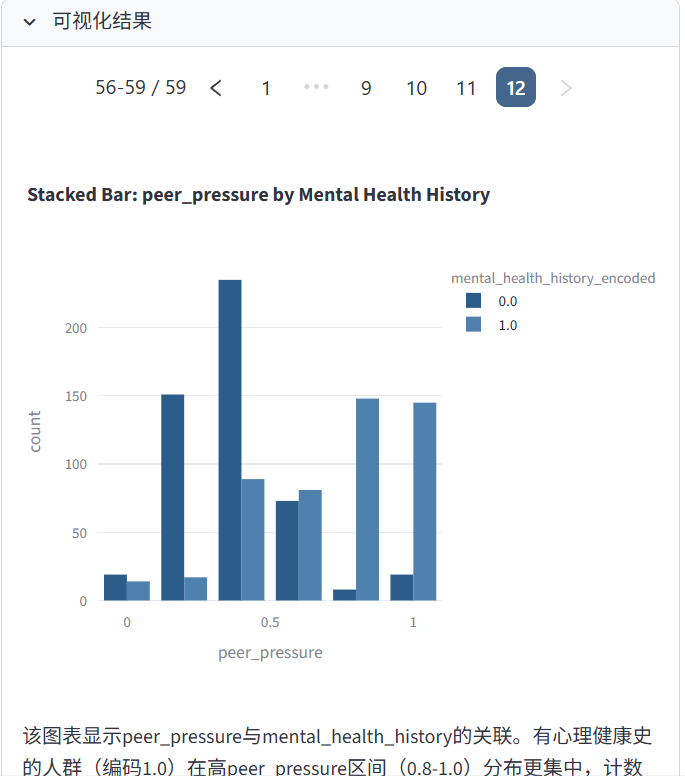

数据可视化模块
============

数据可视化是数据分析的重要组成部分。Anystat 提供了丰富的数据可视化功能，帮助您直观地理解数据特征和关系。

功能特点
---------

.. raw:: html

   <h3>绘图配色调整</h3>

- 系统预设九套精心设计的配色方案，用户可根据个人偏好选择适合的绘图配色，以提升可视化效果。

.. raw:: html

   <h3>可视化操作建议</h3>

- Visualization Agent 基于对数据含义与类型的理解，自动选择并生成适合的单变量与多变量可视化方案。

.. raw:: html

   <h3>代码执行可视化</h3>

- Visualization Agent 基于系统建议与用户需求，自动生成代码以灵活实现可视化展示，用户可在结果界面中下载相应的可视化图像。

操作教程
----------------

配色选择
~~~~~~~~~~~~~~~

在配色选择模块中，选择您偏好的配色方案用于可视化展示。

.. image:: images/数据可视化-配色选择.png
   :alt: 数据可视化-配色选择

可视化建议
~~~~~~~~~~~~~~~

通过与 Visualization Agent 交互，用户可获取可视化方案建议。建议生成后，系统将在对话栏下方显示 “生成可视化代码” 按钮，点击后即可生成可执行的 Python 可视化脚本。

.. note::
   大模型生成的代码可能存在错误，运行过程中如发生异常，Visualization Agent 将自动分析并尝试修复。

可视化执行
~~~~~~~~~~~~~~~

在可视化执行模块中，用户可对生成的代码进行编辑与执行。系统同时提供附加分析开关，支持用户根据需求灵活启用或关闭该功能。

.. note::
   在当前版本中，启用附加分析后，Visualization Agent 将以串行方式依次分析可视化图表。当图表数量较多时，分析过程可能耗时较长。

可视化结果
~~~~~~~~~~~~~~~

在可视化执行模块中点击“执行脚本”后，可在可视化结果模块查看生成的图像结果。对于多张图像，系统提供分页浏览功能，用户可通过翻页查看全部可视化输出（见红框）。

完成数据可视化后，您可以根据需求，选择后续操作。 